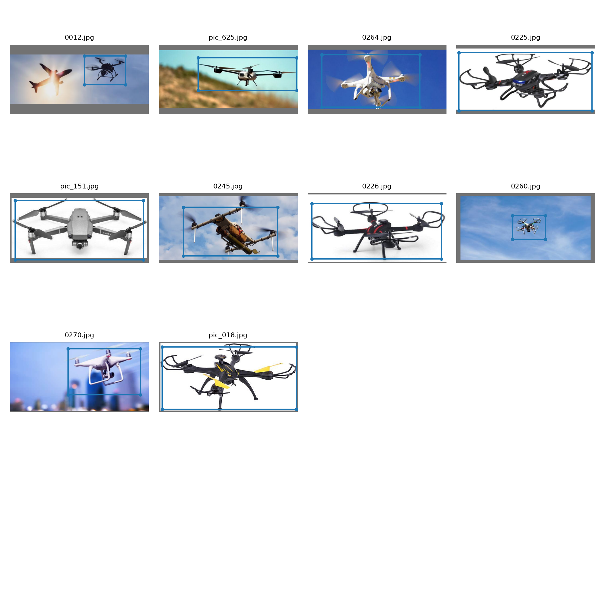

# YoloV3
________
YoloV3 Simplified for training on Colab with custom dataset. 

_A Collage of Training images_


We have added a very 'smal' Coco sample imageset in the folder called smalcoco. This is to make sure you can run it without issues on Colab.

Full credit goes to [this](https://github.com/ultralytics/yolov3), and if you are looking for much more detailed explainiation and features, please refer to the original [source](https://github.com/ultralytics/yolov3). 

You'll need to download the weights from the original source. 
1. Create a folder called weights in the root (YoloV3) folder
2. Download from: https://drive.google.com/file/d/1vRDkpAiNdqHORTUImkrpD7kK_DkCcMus/view?usp=share_link
3. Place 'yolov3-spp-ultralytics.pt' file in the weights folder:
  * to save time, move the file from the above link to your GDrive
  * then drag and drop from your GDrive opened in Colab to weights folder
4. run this command
`python train.py --data data/smalcoco/smalcoco.data --batch 10 --cache --epochs 25 --nosave`

For custom dataset:
1. Clone this repo: https://github.com/miki998/YoloV3_Annotation_Tool
2. Follow the installation steps as mentioned in the repo. 
3. For the assignment, download 500 images of your unique object. 
4. Annotate the images using the Annotation tool. 
```
data
  --customdata
    --images/
      --img001.jpg
      --img002.jpg
      --...
    --labels/
      --img001.txt
      --img002.txt
      --...
    custom.data #data file
    custom.names #your class names
    custom.txt #list of name of the images you want your network to be trained on. Currently we are using same file for test/train
```
5. As you can see above you need to create **custom.data** file. For 1 class example, your file will look like this:
```
  classes=1
  train=data/customdata/custom.txt
  test=data/customdata/custom.txt 
  names=data/customdata/custom.names
```
6. As you it a poor idea to keep test and train data same, but the point of this repo is to get you up and running with YoloV3 asap. You'll probably do a mistake in writing to custom.txt file. This is how our file looks like (please note the .s and /s):
```
./data/customdata/images/img001.jpg
./data/customdata/images/img002.jpg
./data/customdata/images/img003.jpg
...
```
7. You need to add custom.names file as you can see above. For our example, we downloaded images of Walle. Our custom.names file look like this:
```
walle
```
8. Walle above will have a class index of 0. 
9. For COCO's 80 classes, VOLOv3's output vector has 255 dimensions ( (4+1+80)*3). Now we have 1 class, so we would need to change it's architecture.
10. Copy the contents of 'yolov3-spp.cfg' file to a new file called 'yolov3-custom.cfg' file in the data/cfg folder. 
11. Search for 'filters=255' (you should get entries entries). Change 255 to 18 = (4+1+1)*3
12. Search for 'classes=80' and change all three entries to 'classes=1'
13. Since you are lazy (probably), you'll be working with very few samples. In such a case it is a good idea to change:
  * burn_in to 100
  * max_batches to 5000
  * steps to 4000,4500
14. Don't forget to perform the weight file steps mentioned in the sectio above. 
15. Run this command `python train.py --data data/customdata/custom.data --batch 10 --cache --cfg cfg/yolov3-custom.cfg --epochs 3 --nosave`

As you can see in the collage image above, a lot is going on, and if you are creating a set of say 500 images, you'd get a bonanza of images via default augmentations being performed. 


**Results**
After training for 300 Epochs, results look awesome!


Training :

Namespace(epochs=30, batch_size=10, accumulate=4, cfg='cfg/yolov3-custom.cfg', data='data/customdata/custom.data', multi_scale=False, img_size=[512], rect=False, resume=False, nosave=True, notest=False, evolve=False, bucket='', cache_images=True, weights='weights/yolov3-spp-ultralytics.pt', name='', device='', adam=False, single_cls=False)
Using CUDA device0 _CudaDeviceProperties(name='Tesla T4', total_memory=15102MB)

2024-04-30 19:17:00.485459: E external/local_xla/xla/stream_executor/cuda/cuda_dnn.cc:9261] Unable to register cuDNN factory: Attempting to register factory for plugin cuDNN when one has already been registered
2024-04-30 19:17:00.485516: E external/local_xla/xla/stream_executor/cuda/cuda_fft.cc:607] Unable to register cuFFT factory: Attempting to register factory for plugin cuFFT when one has already been registered
2024-04-30 19:17:00.486828: E external/local_xla/xla/stream_executor/cuda/cuda_blas.cc:1515] Unable to register cuBLAS factory: Attempting to register factory for plugin cuBLAS when one has already been registered
2024-04-30 19:17:01.611216: W tensorflow/compiler/tf2tensorrt/utils/py_utils.cc:38] TF-TRT Warning: Could not find TensorRT
Run 'tensorboard --logdir=runs' to view tensorboard at http://localhost:6006/
WARNING: smart bias initialization failure.
WARNING: smart bias initialization failure.
WARNING: smart bias initialization failure.
Model Summary: 225 layers, 6.25733e+07 parameters, 6.25733e+07 gradients
Caching labels (116 found, 0 missing, 0 empty, 0 duplicate, for 116 images): 100% 116/116 [00:00<00:00, 377.24it/s]
Caching images (0.1GB): 100% 116/116 [00:00<00:00, 137.65it/s]
Caching labels (116 found, 0 missing, 0 empty, 0 duplicate, for 116 images): 100% 116/116 [00:00<00:00, 426.47it/s]
Caching images (0.1GB): 100% 116/116 [00:01<00:00, 105.09it/s]
Image sizes 512 - 512 train, 512 test
Using 2 dataloader workers
Starting training for 30 epochs...

     Epoch   gpu_mem      GIoU       obj       cls     total   targets  img_size
/usr/lib/python3.10/multiprocessing/popen_fork.py:66: RuntimeWarning: os.fork() was called. os.fork() is incompatible with multithreaded code, and JAX is multithreaded, so this will likely lead to a deadlock.
  self.pid = os.fork()
  0% 0/12 [00:00<?, ?it/s]/content/drive/MyDrive/yolo/utils/utils.py:374: UserWarning: The torch.cuda.*DtypeTensor constructors are no longer recommended. It's best to use methods such as torch.tensor(data, dtype=*, device='cuda') to create tensors. (Triggered internally at ../torch/csrc/tensor/python_tensor.cpp:83.)
  lcls, lbox, lobj = ft([0]), ft([0]), ft([0])
/usr/local/lib/python3.10/dist-packages/torch/cuda/memory.py:440: FutureWarning: torch.cuda.memory_cached has been renamed to torch.cuda.memory_reserved
  warnings.warn(
      0/29     7.74G      5.19       160         0       165        18       512:   8% 1/12 [00:05<01:02,  5.65s/it]/usr/local/lib/python3.10/dist-packages/torch/cuda/memory.py:440: FutureWarning: torch.cuda.memory_cached has been renamed to torch.cuda.memory_reserved
  warnings.warn(
      0/29     7.74G      5.05      68.8         0      73.8        14       512: 100% 12/12 [00:14<00:00,  1.17s/it]
/usr/local/lib/python3.10/dist-packages/torch/functional.py:507: UserWarning: torch.meshgrid: in an upcoming release, it will be required to pass the indexing argument. (Triggered internally at ../aten/src/ATen/native/TensorShape.cpp:3549.)
  return _VF.meshgrid(tensors, **kwargs)  # type: ignore[attr-defined]
               Class    Images   Targets         P         R   mAP@0.5        F1:   0% 0/12 [00:00<?, ?it/s]/usr/lib/python3.10/multiprocessing/popen_fork.py:66: RuntimeWarning: os.fork() was called. os.fork() is incompatible with multithreaded code, and JAX is multithreaded, so this will likely lead to a deadlock.
  self.pid = os.fork()
               Class    Images   Targets         P         R   mAP@0.5        F1: 100% 12/12 [00:06<00:00,  1.81it/s]
                 all       116       118   0.00166    0.0508    0.0031   0.00321

     Epoch   gpu_mem      GIoU       obj       cls     total   targets  img_size
      1/29     7.24G      4.73      4.02         0      8.75        14       512: 100% 12/12 [00:09<00:00,  1.28it/s]
               Class    Images   Targets         P         R   mAP@0.5        F1: 100% 12/12 [00:05<00:00,  2.32it/s]
                 all       116       118         0         0   0.00392         0

     Epoch   gpu_mem      GIoU       obj       cls     total   targets  img_size
      2/29     8.85G      4.06       2.7         0      6.76        11       512: 100% 12/12 [00:09<00:00,  1.24it/s]
               Class    Images   Targets         P         R   mAP@0.5        F1: 100% 12/12 [00:02<00:00,  4.40it/s]
                 all       116       118         0         0    0.0221         0

     Epoch   gpu_mem      GIoU       obj       cls     total   targets  img_size
      3/29     8.85G       3.6      3.24         0      6.85        13       512: 100% 12/12 [00:09<00:00,  1.20it/s]
               Class    Images   Targets         P         R   mAP@0.5        F1: 100% 12/12 [00:02<00:00,  4.37it/s]
                 all       116       118         0         0     0.242         0

     Epoch   gpu_mem      GIoU       obj       cls     total   targets  img_size
      4/29     8.85G      3.26      3.15         0      6.41        15       512: 100% 12/12 [00:10<00:00,  1.17it/s]
               Class    Images   Targets         P         R   mAP@0.5        F1: 100% 12/12 [00:02<00:00,  4.17it/s]
                 all       116       118         1   0.00847     0.676    0.0168

     Epoch   gpu_mem      GIoU       obj       cls     total   targets  img_size
      5/29     8.85G      3.06      3.08         0      6.14        11       512: 100% 12/12 [00:10<00:00,  1.17it/s]
               Class    Images   Targets         P         R   mAP@0.5        F1: 100% 12/12 [00:02<00:00,  4.23it/s]
                 all       116       118         1   0.00847     0.728    0.0168

     Epoch   gpu_mem      GIoU       obj       cls     total   targets  img_size
      6/29     8.85G      2.46      2.84         0       5.3        12       512: 100% 12/12 [00:10<00:00,  1.19it/s]
               Class    Images   Targets         P         R   mAP@0.5        F1: 100% 12/12 [00:02<00:00,  4.24it/s]
                 all       116       118         1    0.0728     0.691     0.136

     Epoch   gpu_mem      GIoU       obj       cls     total   targets  img_size
      7/29     8.85G      3.28      2.16         0      5.43        10       512: 100% 12/12 [00:09<00:00,  1.21it/s]
               Class    Images   Targets         P         R   mAP@0.5        F1: 100% 12/12 [00:03<00:00,  3.93it/s]
                 all       116       118     0.734     0.702      0.75     0.717

     Epoch   gpu_mem      GIoU       obj       cls     total   targets  img_size
      8/29     8.85G      2.92      1.82         0      4.74        13       512: 100% 12/12 [00:10<00:00,  1.19it/s]
               Class    Images   Targets         P         R   mAP@0.5        F1: 100% 12/12 [00:02<00:00,  4.22it/s]
                 all       116       118     0.599     0.847     0.679     0.702

     Epoch   gpu_mem      GIoU       obj       cls     total   targets  img_size
      9/29     8.85G      2.86      1.71         0      4.57        13       512: 100% 12/12 [00:09<00:00,  1.21it/s]
               Class    Images   Targets         P         R   mAP@0.5        F1: 100% 12/12 [00:02<00:00,  4.34it/s]
                 all       116       118     0.486     0.898     0.659      0.63

     Epoch   gpu_mem      GIoU       obj       cls     total   targets  img_size
     10/29     8.85G      2.57       1.7         0      4.26        12       512: 100% 12/12 [00:10<00:00,  1.19it/s]
               Class    Images   Targets         P         R   mAP@0.5        F1: 100% 12/12 [00:02<00:00,  4.35it/s]
                 all       116       118     0.633     0.482     0.574     0.547

     Epoch   gpu_mem      GIoU       obj       cls     total   targets  img_size
     11/29     8.85G       2.4      1.57         0      3.97        15       512: 100% 12/12 [00:10<00:00,  1.17it/s]
               Class    Images   Targets         P         R   mAP@0.5        F1: 100% 12/12 [00:02<00:00,  4.35it/s]
                 all       116       118     0.669     0.483     0.623     0.561

     Epoch   gpu_mem      GIoU       obj       cls     total   targets  img_size
     12/29     8.85G      2.37      1.31         0      3.68        13       512: 100% 12/12 [00:10<00:00,  1.16it/s]
               Class    Images   Targets         P         R   mAP@0.5        F1: 100% 12/12 [00:02<00:00,  4.39it/s]
                 all       116       118     0.795     0.394     0.746     0.527

     Epoch   gpu_mem      GIoU       obj       cls     total   targets  img_size
     13/29     8.85G      2.72      1.35         0      4.07        11       512: 100% 12/12 [00:10<00:00,  1.18it/s]
               Class    Images   Targets         P         R   mAP@0.5        F1: 100% 12/12 [00:02<00:00,  4.48it/s]
                 all       116       118      0.86     0.636     0.809     0.731

     Epoch   gpu_mem      GIoU       obj       cls     total   targets  img_size
     14/29     8.85G      2.48      1.39         0      3.87        17       512: 100% 12/12 [00:10<00:00,  1.20it/s]
               Class    Images   Targets         P         R   mAP@0.5        F1: 100% 12/12 [00:02<00:00,  4.47it/s]
                 all       116       118     0.823     0.754     0.845     0.787

     Epoch   gpu_mem      GIoU       obj       cls     total   targets  img_size
     15/29     8.85G      2.01      1.24         0      3.25        11       512: 100% 12/12 [00:09<00:00,  1.20it/s]
               Class    Images   Targets         P         R   mAP@0.5        F1: 100% 12/12 [00:02<00:00,  4.50it/s]
                 all       116       118     0.861     0.889     0.928     0.875

     Epoch   gpu_mem      GIoU       obj       cls     total   targets  img_size
     16/29     8.85G      2.45      1.19         0      3.64        11       512: 100% 12/12 [00:09<00:00,  1.21it/s]
               Class    Images   Targets         P         R   mAP@0.5        F1: 100% 12/12 [00:02<00:00,  4.46it/s]
                 all       116       118     0.853     0.737     0.891     0.791

     Epoch   gpu_mem      GIoU       obj       cls     total   targets  img_size
     17/29     8.85G      2.85      1.25         0      4.11        12       512: 100% 12/12 [00:09<00:00,  1.20it/s]
               Class    Images   Targets         P         R   mAP@0.5        F1: 100% 12/12 [00:02<00:00,  4.46it/s]
                 all       116       118     0.845     0.876     0.905      0.86

     Epoch   gpu_mem      GIoU       obj       cls     total   targets  img_size
     18/29     8.85G      2.11      1.19         0       3.3        13       512: 100% 12/12 [00:09<00:00,  1.21it/s]
               Class    Images   Targets         P         R   mAP@0.5        F1: 100% 12/12 [00:02<00:00,  4.45it/s]
                 all       116       118     0.922     0.907     0.949     0.914

     Epoch   gpu_mem      GIoU       obj       cls     total   targets  img_size
     19/29     8.85G      2.13      1.13         0      3.26        14       512: 100% 12/12 [00:09<00:00,  1.20it/s]
               Class    Images   Targets         P         R   mAP@0.5        F1: 100% 12/12 [00:02<00:00,  4.47it/s]
                 all       116       118     0.909     0.851     0.937     0.879

     Epoch   gpu_mem      GIoU       obj       cls     total   targets  img_size
     20/29     8.85G      2.39      1.11         0      3.49        10       512: 100% 12/12 [00:09<00:00,  1.20it/s]
               Class    Images   Targets         P         R   mAP@0.5        F1: 100% 12/12 [00:02<00:00,  4.37it/s]
                 all       116       118     0.953      0.85     0.974     0.898

     Epoch   gpu_mem      GIoU       obj       cls     total   targets  img_size
     21/29     8.85G      2.01       1.1         0      3.11         9       512: 100% 12/12 [00:10<00:00,  1.19it/s]
               Class    Images   Targets         P         R   mAP@0.5        F1: 100% 12/12 [00:02<00:00,  4.32it/s]
                 all       116       118      0.98      0.81     0.976     0.887

     Epoch   gpu_mem      GIoU       obj       cls     total   targets  img_size
     22/29     8.85G      1.97      1.08         0      3.05        13       512: 100% 12/12 [00:10<00:00,  1.20it/s]
               Class    Images   Targets         P         R   mAP@0.5        F1: 100% 12/12 [00:02<00:00,  4.47it/s]
                 all       116       118         1     0.636      0.98     0.778

     Epoch   gpu_mem      GIoU       obj       cls     total   targets  img_size
     23/29     8.85G       1.6      1.04         0      2.63        14       512: 100% 12/12 [00:10<00:00,  1.20it/s]
               Class    Images   Targets         P         R   mAP@0.5        F1: 100% 12/12 [00:02<00:00,  4.42it/s]
                 all       116       118         1     0.556     0.966     0.714

     Epoch   gpu_mem      GIoU       obj       cls     total   targets  img_size
     24/29     8.85G      1.88      1.07         0      2.95         9       512: 100% 12/12 [00:09<00:00,  1.20it/s]
               Class    Images   Targets         P         R   mAP@0.5        F1: 100% 12/12 [00:02<00:00,  4.44it/s]
                 all       116       118     0.975     0.659     0.975     0.787

     Epoch   gpu_mem      GIoU       obj       cls     total   targets  img_size
     25/29     8.85G      1.58      1.06         0      2.63        15       512: 100% 12/12 [00:10<00:00,  1.19it/s]
               Class    Images   Targets         P         R   mAP@0.5        F1: 100% 12/12 [00:02<00:00,  4.29it/s]
                 all       116       118     0.971     0.729     0.975     0.832

     Epoch   gpu_mem      GIoU       obj       cls     total   targets  img_size
     26/29     8.85G       1.5      0.99         0      2.49        11       512: 100% 12/12 [00:09<00:00,  1.20it/s]
               Class    Images   Targets         P         R   mAP@0.5        F1: 100% 12/12 [00:02<00:00,  4.08it/s]
                 all       116       118      0.98     0.824     0.971     0.895

     Epoch   gpu_mem      GIoU       obj       cls     total   targets  img_size
     27/29     8.85G      1.54     0.898         0      2.44        10       512: 100% 12/12 [00:10<00:00,  1.15it/s]
               Class    Images   Targets         P         R   mAP@0.5        F1: 100% 12/12 [00:02<00:00,  4.31it/s]
                 all       116       118     0.963     0.885     0.959     0.922

     Epoch   gpu_mem      GIoU       obj       cls     total   targets  img_size
     28/29     8.85G      1.49     0.958         0      2.45        16       512: 100% 12/12 [00:10<00:00,  1.19it/s]
               Class    Images   Targets         P         R   mAP@0.5        F1: 100% 12/12 [00:02<00:00,  4.30it/s]
                 all       116       118     0.964     0.919     0.953     0.941

     Epoch   gpu_mem      GIoU       obj       cls     total   targets  img_size
     29/29     8.85G      1.92      1.02         0      2.94        12       512: 100% 12/12 [00:10<00:00,  1.20it/s]
               Class    Images   Targets         P         R   mAP@0.5        F1: 100% 12/12 [00:02<00:00,  4.26it/s]
                 all       116       118     0.948     0.924     0.947     0.936
30 epochs completed in 0.111 hours.

Test Result:

