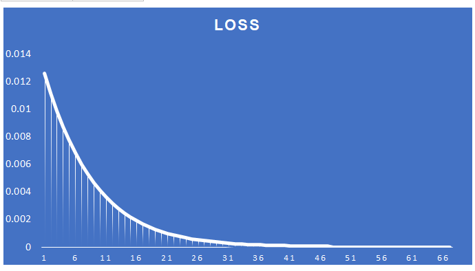

## PART - 1
### Neural Network Backpropagation

This README provides an overview and equations related to backpropagation in a neural network. Backpropagation is a key algorithm for training neural networks by calculating gradients of the loss function with respect to the weights of the network.

##### A simple neural network assuming same data point is repeated.

#### Backpropagation Calculation table

#### Graph shows the loss convergence for different Learning rate
##### LR : 0.1

##### LR : 0.2

##### LR : 0.5

##### LR : 0.8

##### LR : 1.0

##### LR : 2.0

## Part-2

### Train MNIST - Dataset

In this assignment, we aim to train a neural network with fewer than 20,000 parameters while achieving a test accuracy greater than 99.4% on the MNIST dataset.

The model consists of a series of convolutional layers followed by batch normalization, ReLU activation functions, max-pooling, and dropout layers to prevent overfitting.
It starts with an input convolutional layer with 8 output channels, followed by two more convolutional blocks with 8, 16, and 32 output channels, respectively.
Each convolutional block is followed by max-pooling to increase the receptive field and reduce spatial dimensions.
After the convolutional layers, there is a global average pooling layer to reduce the spatial dimensions to 1x1 and a FC layer to map the features to the output classes.
The model has a total of 14,522 parameters

##### Total Parameter is less than 20,000 

##### This log shows the accuracy level for the last couple of epoch.

